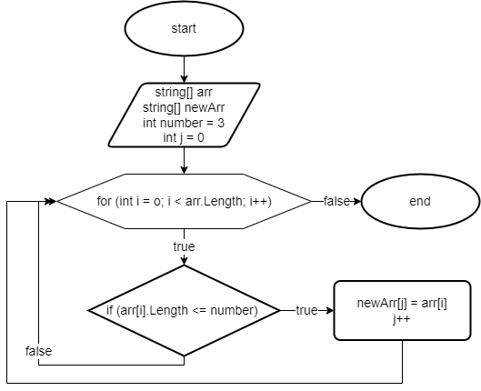

## Описание программы
1. Создаем массив строк со значениями в нем.
2. Создаем метод **GetAmountValues**, который циклом проходит по массиву и возвращает количество значений, удовлетворяющих условию (длина строк меньше или равна 3 символам).
3. Создаем новый массив строк размером, который вернул метод GetAmountValues.
4. Создаем метод **FillNewArray**, который в качестве аргументов принимает созданные ранее два массива строк и целое число (*number*). В методе объявляем переменную *j* и присваиваем ей значение 0 для индексации нового массива. Метод проходит циклом по первому массиву и сравнивает количество символов в значениях с числом которое указано в параметрах метода (*number*). Если количество символов меньше или равна *number*, тогда это значение записываем в новый массив и к индексу *j* прибавляем 1.

5. Печатаем первый и новый массив с помощью метода **PrintArray**.
